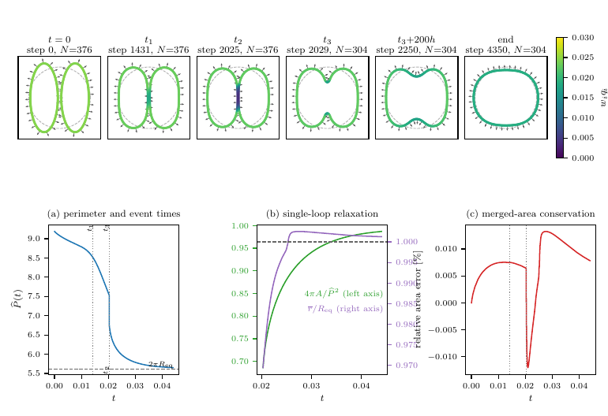
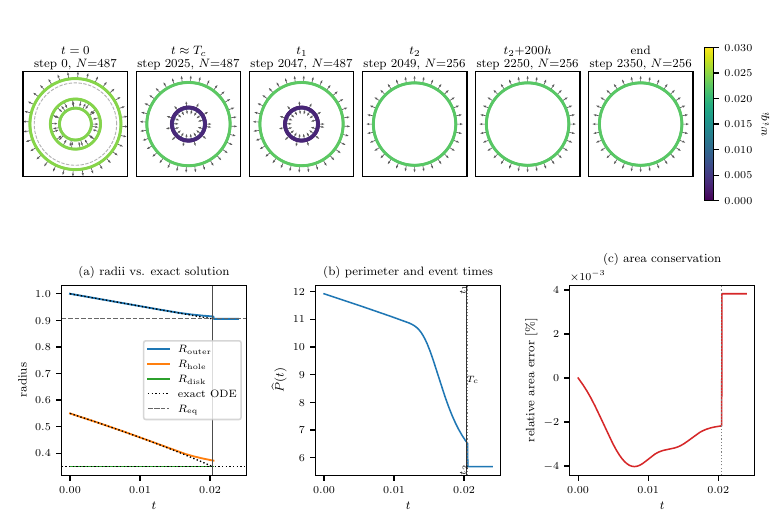

# Mullins–Sekerka flow via oriented point cloud varifolds

Code and data for the paper *Mullins–Sekerka flow as the Wasserstein gradient
flow of the perimeter on oriented point cloud varifolds* (N. Isobe, 2026,
submitted). This is a snapshot of the private development repository; the
history of the experiments is not included.

<table>
<tr>
  <th align="center">Two ellipses (contact, reconnection, relaxation to a disk)</th>
  <th align="center">Concentric disk and annulus (exact solution up to contact)</th>
</tr>
<tr>
<td></td>
<td></td>
</tr>
</table>

The two-dimensional one-phase Mullins–Sekerka flow is computed as a
minimizing-movements scheme for the perimeter in the Wasserstein metric. The
state is an oriented point cloud (positions, unit normals, masses). Each step
minimizes

    P̂(s) + Ŵ_h(s)

over normal displacements `s`, where `P̂` is the visible perimeter of the
oriented point cloud (particle masses estimated from the cloud, weighted by a
coherence factor `q_i` in `[0, 1]` that vanishes where opposite normals
cancel) and `Ŵ_h` is the linearized Wasserstein term, evaluated by a boundary
integral method (single-layer representation of the interior Neumann problem,
three collocation points per particle, one dense block per connected
component). Area and first-moment constraints are imposed through an
orthogonal basis of their complement, the points are redistributed
tangentially after each step, and topological changes (contact of two
components, removal of the cancelled arcs, reconnection into one loop) are
handled by rules stated in the paper's Appendix A.

## Installation

```bash
uv sync                    # Python 3.11, torch (CPU wheels are enough), scipy, matplotlib, ...
uv sync --extra keops      # optional: KeOps backend, used only by the perimeter rate verification
```

The KeOps extra needs a C++ compiler for its JIT. All Mullins–Sekerka runs use
the dense backend and float64 on the CPU.

## Reproducing the computations of the paper

The three production runs of Section 6 (each writes `results/<dir>/*_bie.json`
and a `*_bie_states.pt` file with the stored states; about 0.8–1.3 s per step
on 8 cores):

```bash
# flower (N = 291, 4000 steps)
uv run python scripts/experiments/flower_production.py --steps 4000 --metric bie --tag _bie

# two ellipses (N = 376, 4400 steps): switch, contact, reconnection, relaxation
uv run python scripts/experiments/two_ellipses_benchmark.py \
    --steps 4400 --metric bie --activation wbcc --auto-quotient --auto-splice \
    --first-moment-rows --tag _bie

# concentric disk + annulus (N = 487, 2400 steps): exact ODE until contact, exact equilibrium after
uv run python scripts/experiments/exact_merger_benchmark.py \
    --metric bie --grid 1024 --steps 2400 --endgame --compression atomic \
    --quotient-mode certificate_shadow --bulk-rows \
    --mass-estimator loopwise_oriented_kde --q-mode self_renormalized \
    --angle-scope loopwise --angle-measure raw_loopwise \
    --redist-scope loopwise --redist-curvature loopwise --redist-q-policy r_loop \
    --redist-monotone --contact-rows-mode aligned_prequotient --tag _bie
```

`scripts/experiments/bie_vm_runs.sh` launches the three runs in parallel.
The stored outputs of these runs are committed under `results/flower`,
`results/two_ellipses` (also a run with the initial data rotated by 22.5°,
tag `_bie_rot22`) and `results/exact_merger`.

Figures of the paper (`results/reports/figs/*_bie.pdf`, the `*_numbers.json`
files next to them hold the numbers quoted in the text):

```bash
uv run python scripts/experiments/paper_fig_flower.py       --run flower_production_bie   --out flower_production_bie
uv run python scripts/experiments/paper_fig_two_ellipses.py --run two_ellipses_bie        --out two_ellipses_merger_bie
uv run python scripts/experiments/paper_fig_annulus.py      --run exact_merger_bie        --out annulus_merger_bie
uv run python scripts/experiments/paper_fig_events.py       --ell-run two_ellipses_bie --ann-run exact_merger_bie --out events_schematic_bie
```

Verification of the boundary integral metric (`results/bie_metric`,
`results/reports/bie_*.json`, summary in `results/reports/bie_metric_report.md`):

```bash
uv run python scripts/experiments/bie_grid_parity.py        # static parity against exact modes and the grid Poisson metric
uv run python scripts/experiments/bie_state_diagnostics.py  # sigma_tail, lambda_min, masked particles at the stored states
uv run python scripts/experiments/bie_compat_residual.py    # compatibility residual of the bordered system along the runs
uv run python scripts/experiments/bie_gate_calibration.py   # switch thresholds from the pre-contact motion
```

Convergence rate of the perimeter estimator (Section 3; `results/rate_verification.{png,csv,json}`,
N up to 10⁶, needs the `keops` extra):

```bash
uv run python scripts/experiments/perimeter_rate_verification.py \
    --betas 1.0 0.5 --mark-models deterministic localized-cusp \
    --n-grid 100 1000 10000 30000 100000 1000000 --m-trials 10 --dtype float32
```

## Repository layout

```
src/torch/
├── oriented_varifold/      # state (positions, normals, masses), mass estimation (mass.py, loopwise_mass.py)
├── perimeter/              # visible perimeter (coherence_perimeter.py), angle constraint, contact complex
├── transport/
│   ├── bie_wasserstein.py  # linearized Wasserstein term by the boundary integral method (paper, Section 5.4)
│   ├── bem_wasserstein.py  # dense single-layer assembly shared with the legacy solver
│   ├── boundary_flux_grid.py, grid_wasserstein.py, weighted_poisson.py, phase_grid.py
│   │                       # grid Poisson metric (used for comparison only)
│   ├── incidence.py, loop_geometry.py, contact_certificate.py
│   │                       # loops, winding numbers, contact detection and the quotient switch
│   └── ...
├── solver/
│   ├── mm_step.py          # one minimizing-movements step (MMConfig, MMStepper)
│   ├── mm_solver.py        # time loop, events
│   ├── redistribute.py, redistribution_rules.py, arc_splice.py, ghost_compression.py
│   ├── quotient_gates_bie.py, quotient_gates.py   # switch thresholds (BIE / grid)
│   └── ...
├── shapes/                 # initial data (flower, ellipses, annulus, ...)
├── math_utils/             # pairwise kernels (naive and KeOps), truncated SVD, curvature
└── visualization/          # figures and movies

scripts/experiments/        # drivers, figure scripts, verification scripts (see above)
scripts/examples/           # earlier showcase drivers
tests/                      # pytest suite: uv run pytest tests/
results/                    # stored runs, figures and diagnostics used in the paper
run.py                      # earlier single-phase command line interface (dense BEM metric)
```

Many scripts under `scripts/experiments/` and several test files belong to the
development of the method (grid Poisson metric, calibrations, earlier
benchmarks); they are kept so that the tests run and the reported
comparisons can be repeated. The drivers used for the paper are the three
listed above.

## Tests

```bash
uv run pytest tests/                       # full suite (a few minutes on 8 cores)
uv run pytest tests/test_bie_wasserstein.py tests/test_bie_mm_step.py -v   # boundary integral metric only
```

The KeOps parity tests are skipped when the `keops` extra is not installed.

## Citation

```bibtex
@software{isobe_msflow_2026,
  author = {Isobe, Noboru},
  title  = {Mullins--Sekerka flow via oriented point cloud varifolds},
  year   = {2026},
  url    = {https://github.com/noboru-isobe/oriented-pointcloud-msflow}
}
```

## License

MIT License, see [LICENSE](LICENSE).
