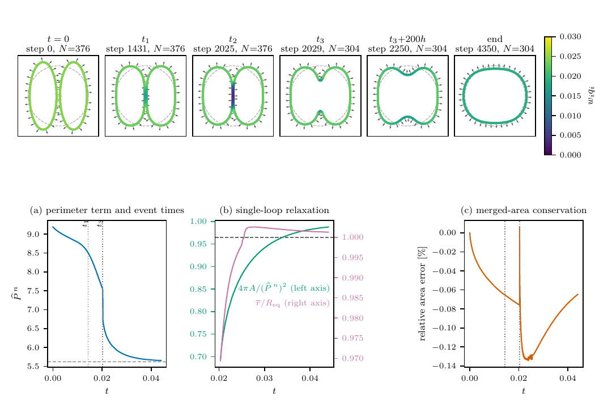
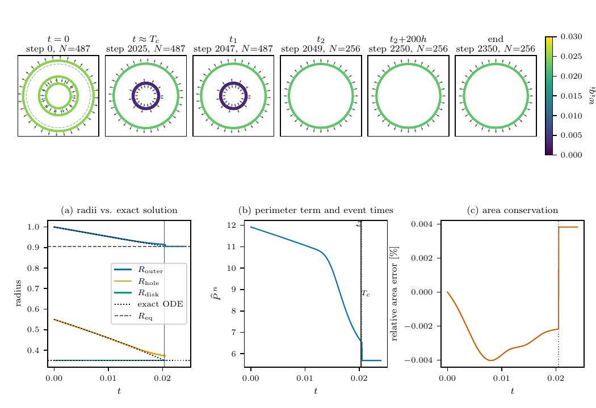

# Mullins–Sekerka flow via oriented point cloud varifolds

Code and data for the paper *Oriented point-cloud varifolds for estimating the
perimeter and computing its Wasserstein gradient flow* (T. Eto and N. Isobe,
2026). This is a snapshot of the private development repository. The history
of the experiments is not included.

<table>
<tr>
  <th align="center">Two ellipses (contact, reconnection, relaxation to a disk)</th>
  <th align="center">Concentric disk and annulus (exact solution up to contact)</th>
</tr>
<tr>
<td></td>
<td></td>
</tr>
</table>

The two-dimensional one-phase Mullins–Sekerka flow is computed as a
minimizing-movements scheme for the perimeter in the Wasserstein metric. The
state is an oriented point cloud (positions, unit normals, masses). Each step
minimizes

    P̂(s) + Ŵ_h(s)

over normal displacements `s`, where `P̂` is the visible perimeter of the
oriented point cloud (particle masses estimated from the cloud, weighted by
the visibility `q_i` in `[0, 1]`, which vanishes where opposite normals
cancel; the code calls it `coherence`) and `Ŵ_h` is the linearized Wasserstein term, evaluated by a boundary
integral method (single-layer representation of the interior Neumann problem,
three collocation points per particle, one dense block per connected
component). Area and first-moment constraints are imposed through an
orthogonal basis of their complement, the points are redistributed
tangentially after each step, and topological changes are carried out by the
four events of the paper's Appendix A (switch of the visibility, merging of
the constraints, removal of the canceling pair, reconnection of the arcs).
The table at the end of this file relates the symbols and names of the paper
to the names and values in the code.

## Installation

```bash
uv sync                    # Python 3.11, torch (CPU wheels are enough), scipy, matplotlib, ...
uv sync --extra keops      # optional: KeOps backend, used only by the perimeter rate verification
```

The KeOps extra needs a C++ compiler for its JIT. All Mullins–Sekerka runs use
the dense backend and float64 on the CPU.

## Reproducing the computations of the paper

The three production runs of Section 6 (each writes `results/<dir>/*<tag>.json`
and a `*<tag>_states.pt` file with the states stored every 25 steps; about
0.8–1.4 s per step on 8 cores):

```bash
# flower (N = 291, 4000 steps)
uv run python scripts/experiments/flower_production.py --steps 4000 --metric bie --tag _bie

# two ellipses (N = 376, 4400 steps): switch, contact, reconnection, relaxation
uv run python scripts/experiments/two_ellipses_benchmark.py \
    --steps 4400 --metric bie --activation wbcc --auto-quotient --auto-splice \
    --first-moment-rows --tag _bie2

# concentric disk + annulus (N = 487, 2400 steps): exact ODE until contact, exact equilibrium after
uv run python scripts/experiments/exact_merger_benchmark.py \
    --metric bie --grid 1024 --steps 2400 --endgame --compression atomic \
    --quotient-mode certificate_shadow --bulk-rows \
    --mass-estimator loopwise_oriented_kde --q-mode self_renormalized \
    --angle-scope loopwise --angle-measure raw_loopwise \
    --redist-scope loopwise --redist-curvature loopwise --redist-q-policy r_loop \
    --redist-monotone --contact-rows-mode aligned_prequotient --tag _bie
```

The stored outputs of these runs are committed under `results/flower`,
`results/two_ellipses` and `results/exact_merger`. The flower and annulus
results (tag `_bie`) were produced by `scripts/experiments/bie_vm_runs.sh`
before the present snapshot. The two-ellipses results of the
paper (tag `_bie2`) were produced by
`scripts/experiments/order_free_vm_runs.sh` with the present code, in which
the order of the particles along a loop, where an event needs it, is derived
from the state and never read from the storage order. That script also runs
the same computation with the particles of each loop stored in a random order
(`--shuffle-seed 1`, tag `_bie2_shuffle`): the events take place at the same
steps (1431, 2025, 2029) and the reported quantities agree to the digits
quoted in the paper. The two runs differ by about 1e-6 in the perimeter term
before the reconnection and 2e-4 after it, which is also the size of the
difference between two runs with the same storage order (`_bie` and `_bie2`),
because the number of iterations of the minimization at single steps is
sensitive to rounding. `results/two_ellipses` also keeps the earlier run
`_bie` (the event schematic of the paper was drawn from its states) and a run
with the initial data rotated by 22.5° (tag `_bie_rot22`).

Figures of the paper (`results/reports/figs/`, the `*_numbers.json` files next
to them hold the numbers quoted in the text):

```bash
uv run python scripts/experiments/paper_fig_flower.py       --run flower_production_bie   --out flower_production_bie_v2
uv run python scripts/experiments/paper_fig_two_ellipses.py --run two_ellipses_bie2       --out two_ellipses_merger_bie2_v2
uv run python scripts/experiments/paper_fig_annulus.py      --run exact_merger_bie        --out annulus_merger_bie_v2
uv run python scripts/experiments/paper_fig_events.py       --ell-run two_ellipses_bie --ann-run exact_merger_bie --out events_schematic_bie
```

The area, the barycenter and the circularity reported for the two ellipses are
the order-free quantities defined in Section 6.2 of the paper (series keys
`A_cur`, `circ`, `r_mean_cur`; the barycenter is `centered_barycenter` in
`two_ellipses_benchmark.py`). The keys `A`, `bar`, `isoperimetric` hold the
area, centroid and isoperimetric ratio of the polygon through the particles,
which the earlier figures (`*_bie.pdf`) showed.

Verification of the boundary integral metric (`results/bie_metric`,
`results/reports/bie_*.json`, summary in `results/reports/bie_metric_report.md`):

```bash
uv run python scripts/experiments/bie_grid_parity.py        # static parity against exact modes and the grid Poisson metric
uv run python scripts/experiments/bie_state_diagnostics.py  # sigma_tail, lambda_min, masked particles at the stored states
uv run python scripts/experiments/bie_compat_residual.py    # compatibility residual of the bordered system along the runs
uv run python scripts/experiments/bie_gate_calibration.py   # switch thresholds from the pre-contact motion
```

Convergence rate of the perimeter estimator (Section 3; `results/rate_verification.{png,csv,json}`,
N up to 10⁶, needs the `keops` extra):

```bash
uv run python scripts/experiments/perimeter_rate_verification.py \
    --betas 1.0 0.5 --mark-models deterministic localized-cusp \
    --n-grid 100 1000 10000 30000 100000 1000000 --m-trials 10 --dtype float32
```

## Repository layout

```
src/torch/
├── oriented_varifold/      # state (positions, normals, masses), mass estimation (mass.py, loopwise_mass.py)
├── perimeter/              # visible perimeter (coherence_perimeter.py), angle constraint, contact complex
├── transport/
│   ├── bie_wasserstein.py  # linearized Wasserstein term by the boundary integral method (paper, Section 5.4)
│   ├── bem_wasserstein.py  # dense single-layer assembly shared with the legacy solver
│   ├── boundary_flux_grid.py, grid_wasserstein.py, weighted_poisson.py, phase_grid.py
│   │                       # grid Poisson metric (used for comparison only)
│   ├── incidence.py, loop_geometry.py, contact_certificate.py
│   │                       # loops, winding numbers, contact detection and the quotient switch
│   └── ...
├── solver/
│   ├── mm_step.py          # one minimizing-movements step (MMConfig, MMStepper)
│   ├── mm_solver.py        # time loop, events
│   ├── redistribute.py, redistribution_rules.py, arc_splice.py, ghost_compression.py
│   ├── quotient_gates_bie.py, quotient_gates.py   # switch thresholds (BIE / grid)
│   └── ...
├── shapes/                 # initial data (flower, ellipses, annulus, ...)
├── math_utils/             # pairwise kernels (naive and KeOps), truncated SVD, curvature
└── visualization/          # figures and movies

scripts/experiments/        # drivers, figure scripts, verification scripts (see above)
scripts/examples/           # earlier showcase drivers
tests/                      # pytest suite: uv run pytest tests/
results/                    # stored runs, figures and diagnostics used in the paper
run.py                      # earlier single-phase command line interface (dense BEM metric)
```

Many scripts under `scripts/experiments/` and several test files belong to the
development of the method (grid Poisson metric, calibrations, earlier
benchmarks); they are kept so that the tests run and the reported
comparisons can be repeated. The drivers used for the paper are the three
listed above.

## Correspondence between the paper and the code

Names. The code keeps the working names of the development.

| Paper | Code |
|---|---|
| visibility `q` | `coherence` |
| `q^loop` (renormalization loop by loop) | `--q-mode self_renormalized`, "WB" |
| `q^arc` (renormalization arc by arc) | `contact_complex_renormalized`, "CC" |
| (i) switch of the visibility | `--activation wbcc`, "activation" |
| (ii) merging of the constraints | `--auto-quotient` (two ellipses), `--quotient-mode certificate_shadow` (annulus), "quotient" |
| (iii) removal of the canceling pair | `--endgame --compression atomic`, `ghost_compression.py`, "compression" |
| (iv) reconnection of the arcs | `--auto-splice`, `arc_splice.py`, "splice" |
| criterion of an event | "certificate" |
| auxiliary step and its tolerances | "shadow" step, "gates" |
| particles held fixed | "masked", "frozen" |

Parameters and thresholds (all fixed before the reported runs).

| Paper | Value | Where |
|---|---|---|
| mollifier scale σ | 0.1 | `SIGMA`, `scripts/experiments/p1_production_comparison.py` |
| time step h | 1e-5 | `--dt` of the drivers |
| density bandwidth δ, truncation τ (A.1) | median 10th-neighbor distance, 2ψ(0)/(N Z δ), once from the initial cloud | `compute_recommended_params`, `src/torch/oriented_varifold/mass.py` |
| kernel regularization ε_reg | 0.15 ℓ | `BIEMetricConfig.epsilon_scale`, `src/torch/transport/bie_wasserstein.py` |
| components joined by the metric | gap ≤ ℓ | `bridge_gap_over_ell = 1.0` |
| particles held fixed | partner within 1.5 ℓ, `u_i·u_j ≤ -0.9` | `mask_gap_over_ell`, `anti_parallel_tol` |
| monitors of the metric | 1e-6, 1e-6, 0.1 | `sigma_tail_min`, `definiteness_tol`, `compat_reject_tol` |
| minimization | trust-region Newton CG, gradient tolerance 1e-8, at most 300 iterations | `make_cfg`, `p1_production_comparison.py` |
| redistribution: δ_red, h_red | 0.5 δ, 0.01 | `redistribute_delta_ratio`, `redistribute_step_size` in `MMConfig` (`src/torch/solver/mm_step.py`) |
| redistribution: tolerance, iterations, bound | 1e-4 (coefficient of variation of θ^red per loop), at most 10 per step, 0.05 δ_red, scalings 2^-k with k ≤ 7 | `redistribute_tol`, `redistribute_n_iters`, `redistribute_max_disp_ratio`, `src/torch/solver/redistribution_rules.py` |
| winding numbers | regularization ℓ²/4, 8 points at depths 1.5, 2.5, 4 ℓ, margin 0.15 | `EPS_WIND`, `src/torch/transport/incidence.py` |
| (i) threshold of the switch | gap ≤ 0.55 σ, one pair of arcs with at least 3 particles | `ACT_GAP_OVER_SIGMA`, `two_ellipses_benchmark.py` |
| (i) tolerances of the auxiliary step | 1.796e-7 (areas), 1.709e-7 (first moments) | `EPS_A_FLOOR`, `EPS_M_FLOOR` |
| (ii) criterion, two ellipses | contact region within 1.5 ℓ; anti-parallelism ≤ 0.0507, mass balance ≤ 0.05, tapered current ≤ 0.0338 | `results/two_ellipses/l1_calibration/l1_thresholds.json`, `window_certificate` in `scripts/experiments/l1_quotient_shadow.py` |
| (ii) criterion, annulus | 90th-percentile gap / ℓ ≤ 1.256, mass fraction within 1.5 ℓ ≥ 0.628, anti-parallelism ≤ 0.0446, mass balance ≤ 0.0649, current residual ≤ 0.0474 | `ContactThresholds`, `src/torch/transport/contact_certificate.py` |
| (ii) tolerances of the auxiliary step, two ellipses | 1e-9, 3.09e-3 (position / ℓ), 1.99e-3 (angle), 3.97e-7 (area) | `QUOTIENT_GATES_BIE`, `src/torch/solver/quotient_gates_bie.py` |
| (ii), (iii) tolerances of the auxiliary step, annulus run | 1e-9, 1.396e-2, 3.29e-5, 3.97e-7 | `QUOTIENT_GATES`, `src/torch/solver/quotient_gates.py` (see the note below) |
| (iii) three consecutive steps, algebraic residual | 3, 1e-12 | `exact_merger_benchmark.py`, `EPS_ALG` in `ghost_compression.py` |
| (iv) removed arcs | distance to the other loop ≤ 0.08 | `--cut-gap` |
| (iv) smoothing, correction | 12 sweeps over 6 neighbors on each side, Newton with residual 1e-10 | `src/torch/solver/arc_splice.py` |

Note on the annulus run. Its merging step was checked against the tolerances
of `quotient_gates.py` (the values stored in `results/exact_merger/exact_merger_bie.json`).
The present code selects `quotient_gates_bie.py` for that step. Both steps of
that auxiliary comparison had zero displacement, so the outcome does not
depend on the choice.

The order of the particles along a loop is derived from the state
(`certify_loop_orders`, `derived_loop_permutation` in
`src/torch/perimeter/contact_complex.py`) wherever an event needs it.
`tests/test_order_free_events.py` checks on stored states of the two-ellipses
run that the criterion of (ii), the reconnection and the removal are unchanged
under random permutations of the particles inside each loop.

### Details that the paper leaves to this file

Appendix A of the paper states the rules of the implementation. The details
below complete it.

- **Bandwidths.** `τ` equals twice the value of the density estimator produced
  at a particle by that particle alone, so that the truncation acts only on
  particles with fewer than about one neighbor within distance `δ`. In the
  three runs `δ ≈ 0.12` and `τ ≈ 0.05`–`0.08`.
- **Metric.** Particles with zero mass (none occurred in the reported runs)
  are excluded from the collocation. A row of the constraint matrix which
  becomes a combination of the unit rows of the fixed particles (the relative
  area row of a pair of entirely coincident loops) is dropped. At the stored
  states of the three runs (every 25 steps) the ratio of the residual `|μ|` to
  `|D^{1/2} V(s)|` is below 1.6e-2, with median 1.9e-3
  (`scripts/experiments/bie_compat_residual.py`).
- **Redistribution.** The density is recomputed on the current positions at
  every substep, and the tangents and curvatures are held at their values at
  the beginning of the redistribution. Loops that already meet the tolerance
  are left unchanged. A substep is accepted only if it does not increase the
  coefficient of variation of its loop. It is scaled by `2^-k`, `k = 0, …, 7`,
  and the loop is left unchanged if no scaling is accepted. The total
  displacement of a particle over the whole redistribution is bounded.
- **Winding numbers.** For every loop, eight points `p = x_i − ϱ u_i` are
  placed on its inner side at each depth `ϱ ∈ {1.5, 2.5, 4} ℓ`. The winding
  numbers of all loops about them are computed and rounded to integers after
  taking the median over the eight points. The medians must lie within 0.15 of
  an integer and the rounded vectors must coincide at the three depths.
  Otherwise the run is stopped.
- **(i) Switch of the visibility.** The contact region consists of the
  particles of each loop whose `σ`-neighborhood meets the other loop. It must
  consist of exactly one pair of arcs with at least three particles each.
- **(ii) Merging of the constraints, two ellipses.** The particles of each
  loop within distance `1.5 ℓ` of the other loop must form one arc on each
  loop. Each particle of one arc is paired with the nearest particle of the
  other arc, and the pairing must preserve the order of the particles along
  the arcs. Three quantities must be below their thresholds, namely the
  anti-parallelism `max (1 + u_i·u_j)` over the pairs, the relative difference
  of the masses of the two arcs, and the norm of the sum of `w_i u_i` over the
  two arcs, tapered toward the ends of each arc and taken relative to the
  tapered mass. The thresholds were fixed on an analytic family of facing
  parabolic arcs.
- **(ii) Merging of the constraints, annulus.** The contact is simultaneous
  along a circle, and the quantities are evaluated on the whole loops, namely the
  mass-weighted 90th percentile of the distances to the nearest particle of
  the other loop over `ℓ`, the mass fraction of each loop within distance
  `1.5 ℓ` of the other loop, the mass-weighted mean of `|u_i + u_j|²` over the
  nearest pairs, the relative difference of the masses, and the relative
  residual `‖G∗(T_1+T_2)‖² / (‖G∗T_1‖² + ‖G∗T_2‖²)` of the currents `T_1`,
  `T_2` of the two loops mollified by a Gaussian `G` of width `σ`.
- **(ii) Auxiliary step.** The point cloud is advanced once with the separate
  rows and once with the merged rows. The differences in the individual and
  merged areas, in the positions and normals, and in the objective must stay
  below the tolerances.
- **(iii) Removal of the canceling pair.** In the concentric benchmark the gap
  is the difference of the mean radii of the two loops. The areas are those of
  the polygons through the particles, joined in the cyclic order derived from
  the state. After the removal the loop must be simple, keep its orientation
  and not increase the length of the polygon through its particles, and the
  auxiliary step advanced from the point cloud after the removal must agree
  with the one advanced from the point cloud before it within the tolerances.
- **(iv) Reconnection of the arcs.** After the two cubic Hermite arcs are
  inserted, the polygon is smoothed near the new particles, and a least-norm
  normal displacement of the new loop, closed by a Newton iteration on the
  exact polygon area and first moment, restores the merged area and first
  moment. Both candidate reconnections are constructed. The one kept gives a
  single simple loop with outward orientation, no increase of the length of
  the polygon through the particles, a spacing within the bounds of the
  existing loops, and connecting arcs crossing the former gap.
- **Thresholds.** All thresholds were fixed before the reported runs, on
  analytic families of facing arcs, on static configurations in which the
  event should or should not take place, or on the pre-contact part of earlier
  trajectories. None was adjusted on the reported runs.

## Tests

```bash
uv run pytest tests/                       # full suite (a few minutes on 8 cores)
uv run pytest tests/test_bie_wasserstein.py tests/test_bie_mm_step.py -v   # boundary integral metric only
```

The KeOps parity tests are skipped when the `keops` extra is not installed.

## Citation

```bibtex
@software{isobe_msflow_2026,
  author = {Isobe, Noboru},
  title  = {Mullins--Sekerka flow via oriented point cloud varifolds},
  year   = {2026},
  url    = {https://github.com/noboru-isobe/oriented-pointcloud-msflow}
}
```

## License

MIT License, see [LICENSE](LICENSE).
